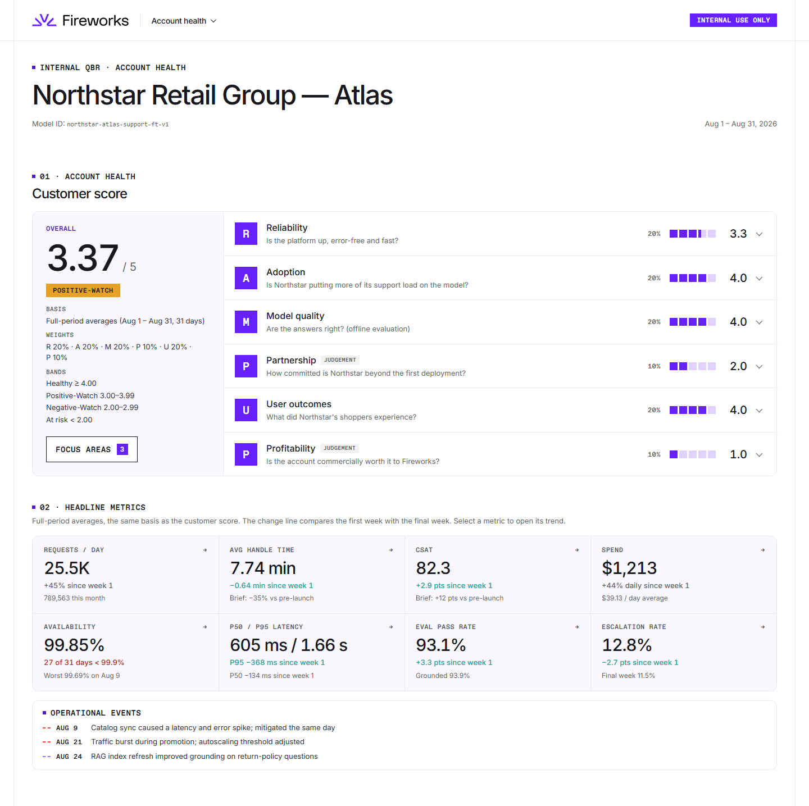
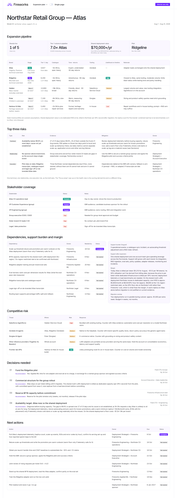
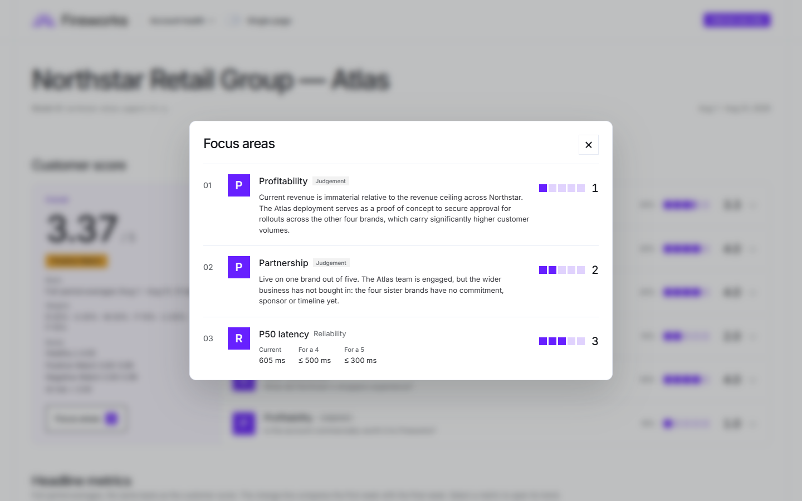
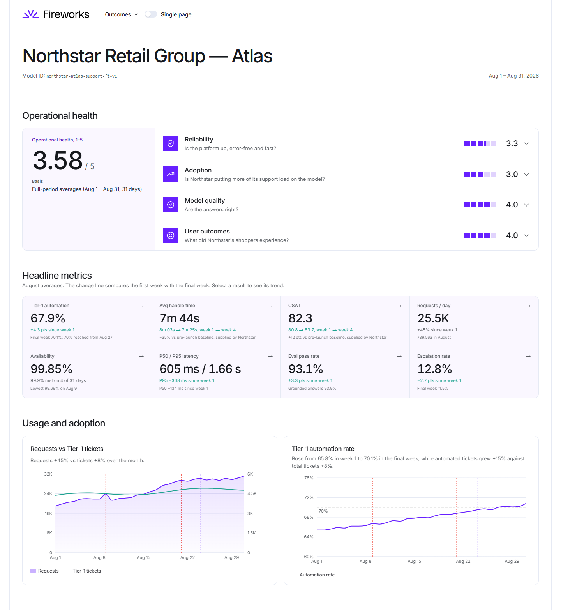
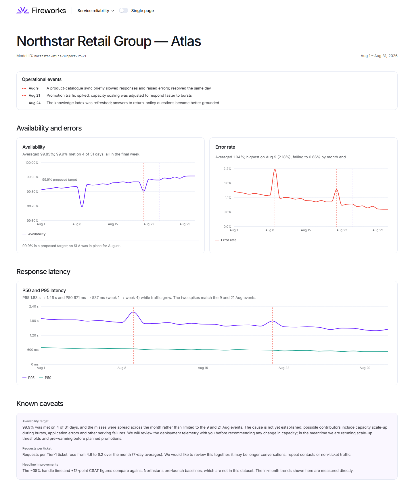
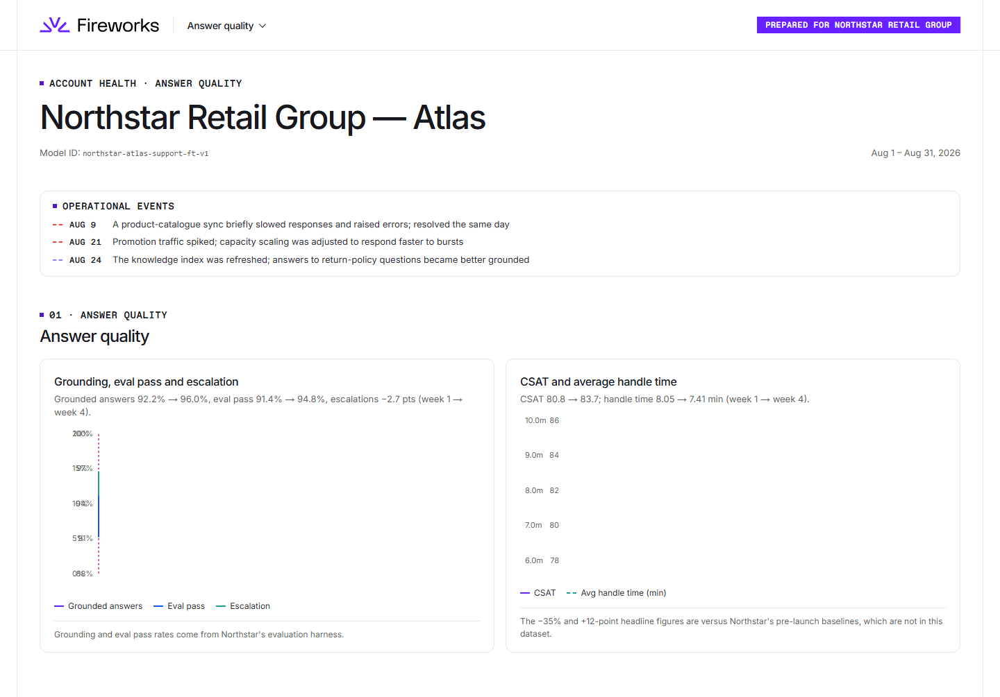
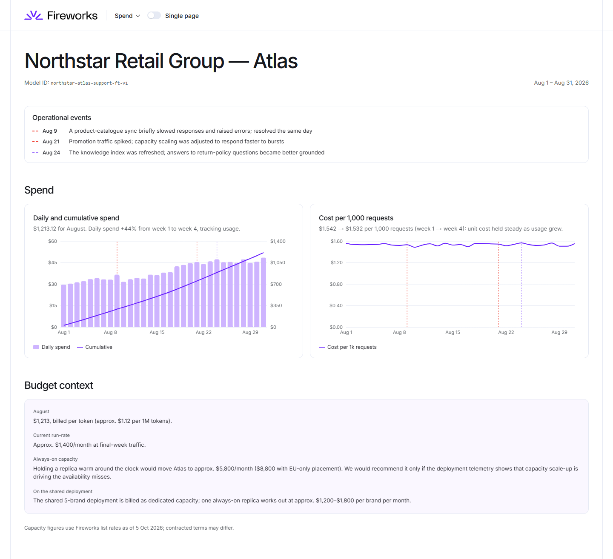
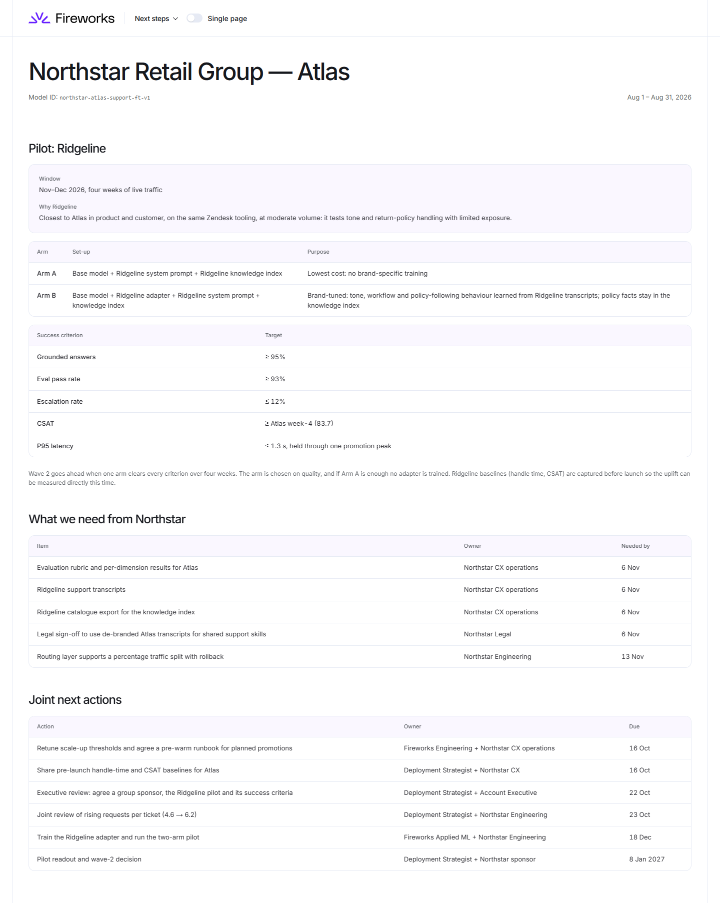

# Dashboard design

Two dashboards built from the same August dataset: an **internal QBR** for Fireworks and a **customer health** view for Northstar. They are separate apps sharing one data and design package, so internal judgement can never reach the customer build. Every decision and its reasoning is logged in [DECISIONS.md](DECISIONS.md) (appendix).

## 1. Internal QBR (`internal-qbr/`, port 5173)

| Account health | Performance trends |
|---|---|
|  |  |

| Expansion plan | Focus areas dialog |
|---|---|
|  |  |

## 2. Customer health (`customer-health/`, port 5174)

| Outcomes | Service reliability |
|---|---|
|  |  |

| Answer quality | Spend |
|---|---|
|  |  |

| Next steps |
|---|
|  |

## 3. Audience and purpose

| View | Audience | Job |
|---|---|---|
| Internal: Account health | Fireworks account, engineering and leadership | One number for the account, the items furthest from target, the headline metrics behind both |
| Internal: Performance trends | Engineering, account team | The evidence: nine daily charts, with operational events marked |
| Internal: Expansion plan | Leadership, account team | Where to focus: pipeline across four brands, top three risks, stakeholder gaps, dependencies, margin, competitive risk, decisions needed, actions with owners and dates |
| Customer: Outcomes → Next steps | Northstar VP Customer Experience and VP Engineering | Demonstrated outcomes, operational transparency (including caveats), spend in context, and the joint plan |

## 4. Why these metrics and charts

- **Headline tiles first, charts one click away.** Each tile is a full-period average with the week-1 → final-week change underneath, and links to its chart. Leaders read the tiles; engineers follow the links.
- **Full-period averages, not the last week.** A strong final week would flatter the score: the final week alone scores higher than the month as a whole. Trends are shown separately as change lines and charts.
- **The brief's three outcomes** (automation, handle time, CSAT) are on both dashboards, each with its caveat attached: 70% is the month-end figure, and −35% and +12 depend on Northstar's pre-launch baselines.
- **Operational events on every chart** (dashed markers for 9, 21 and 24 Aug), so a spike is always read alongside its cause.
- **Line charts for rates and latency, bars for daily spend with a cumulative line,** dual axes only where two related units share a story (requests vs tickets, CSAT vs handle time).

## 5. How the score is calculated

**RAMP UP**, adapted from GitLab's PROVE. Full method, every band and its source: [RAMPUP.md](RAMPUP.md).

| Pillar | Weight | Scored by |
|---|---|---|
| Reliability | 20% | availability, error rate, P50/P95 latency vs benchmark bands |
| Adoption | 20% | Tier-1 automation penetration (request volume is consumption, not adoption, so it is not scored) |
| Model quality | 20% | grounded answers, eval pass |
| Partnership | 10% | account-team judgement (internal only) |
| User outcomes | 20% | CSAT, handle time and first-contact resolution |
| Profitability | 10% | account-team judgement, Fireworks' commercial view (internal only) |

- Each metric scores 1–5 on its **full-period average**, rounded to display precision first; a pillar is the weighted mean of its metrics.
- **Internal: 3.17 / 5, Positive-Watch** (Healthy ≥ 4, Positive-Watch ≥ 3, Negative-Watch ≥ 2, At risk < 2).
- **Customer: 3.58 / 5** from the four measured pillars only; the judgement pillars' weight is redistributed, so each shows as 25%.
- **Focus areas** lists the three items furthest from a perfect 5, by exact position within each band.

## 6. Internal vs customer

| Item | Internal QBR | Customer health |
|---|---|---|
| Health score | All six pillars, 3.17, status band shown | Four measured pillars, 3.58, "Operational health, 1–5", no status band |
| Focus areas (lowest-scoring items) | Yes | No |
| Headline metrics and trend charts | Yes | Yes, same figures |
| Operational events | As logged | Restated in plain customer language |
| Top three risks | Technical, relationship, execution | No (the caveats card covers what Northstar needs to know) |
| Pipeline, likelihood on timeline, stakeholder coverage | Yes | No |
| Margin, deployment economics, competitive risk | Yes | No |
| Spend | Margin card at list rates | Budget context: bill, run-rate, and what always-on capacity would cost alone and shared |
| Plan | Dependencies on both sides, leadership decisions, all actions | Pilot proposal, Northstar's dependencies, joint actions only |

## 7. Intentionally excluded

- **From the customer view:** Partnership and Profitability scores, status band, Focus areas, expansion likelihood, stakeholder status, competitors, margin, capacity reservation and commercial-structure decisions. A boundary test (`internal-qbr/src/customer-boundary.test.ts`) fails if the customer app imports internal code or uses that vocabulary.
- **From both:** per-conversation drill-down (the data is daily), pre-launch baselines (not supplied), and any SLA claim (none was in place for August).
- **From the internal view:** methodology prose on the page. It lives in the docs, so the page stays facts and evidence.

## 8. Assumptions, caveats and trade-offs

**Data and scenario**
- **Billing:** `spend_usd` tracks tokens at a constant ~$1.12 per 1M ($1.110–1.123 on every day), so Atlas is billed per token today; on the multi-LoRA deployment Northstar moves to paying for dedicated capacity per GPU-second. GPU utilisation can't be derived from token billing and is not quoted; it needs telemetry or load benchmarks.
- **Atlas** is a LoRA adapter on an open-weight base, trained on Atlas data only, served by live merge on its own autoscaling dedicated deployment. Custom models can't run serverless on Fireworks.
- **Latency** columns are assumed to be time-to-first-token (331 output tokens in ~600 ms end-to-end isn't plausible).
- **Brands and names:** Northstar is an outerwear holding company; Atlas is the flagship. The four sister brands (Ridgeline, Halden, Polar, Harbour & Hide) are invented because the brief's descriptions were not supplied.
- **CSAT** is assumed to be % satisfied. The 99.9% availability target is proposed, not contractual.

**Pricing**
- From fireworks.ai/pricing, **checked 5 Oct 2026**: H100 $8.00/GPU-hour (up from $7.00 on 1 Sep), region-restricted deployments 1.5×, fine-tuned models served at base price. Re-check before presenting.
- Code reads every constant from `shared/src/pricing.ts`.

**Open items (from [ARCHITECTURE.md](ARCHITECTURE.md))**
- Atlas's actual serving set-up and how spend maps to the bill.
- Sister-brand transcript volumes.
- Northstar's sign-off on de-branded Atlas transcripts.
- Base model fit on one H100 at the required concurrency.

**Trade-offs**
- **Two apps instead of one with roles:** some duplicated view code, in exchange for a customer build that can't contain internal data.
- **Lenient availability bands** (99.9% = 5) rather than Fireworks' 99.99% SLA, which would score August a 2. The alternative is documented in RAMPUP.md.
- **Telemetry before capacity.** The 99.85% availability gap is diagnosed from deployment telemetry before any warm replica is bought; the cause can't be read from daily metrics. A warm floor is cheap per brand once five brands share it.
- **One shared BF16 multi-LoRA deployment** (no FP8 with adapters, +10–30% TTFT) rather than five FP8 deployments; Halden moves to its own when its volume justifies it.

## Appendix

[DECISIONS.md](DECISIONS.md): every decision (#1–55), with the reasoning and the alternative rejected.
