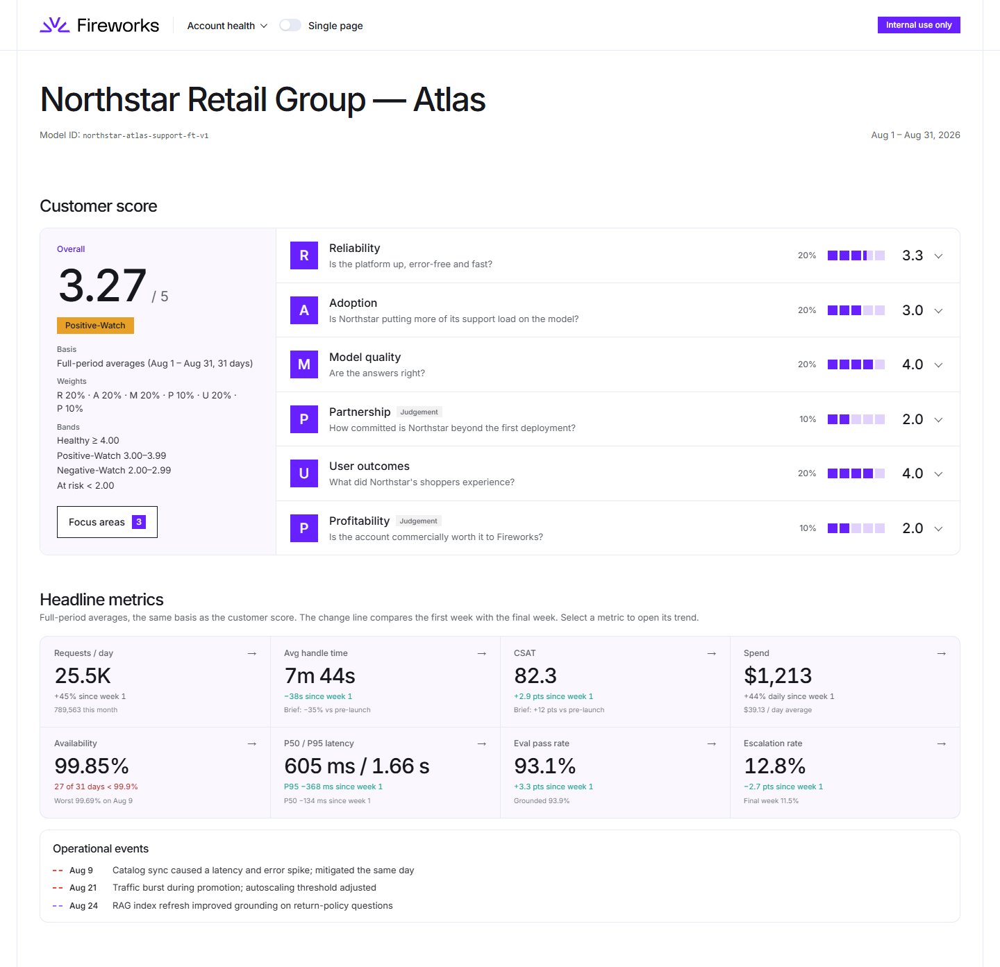
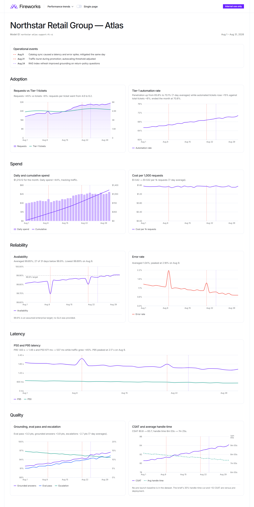
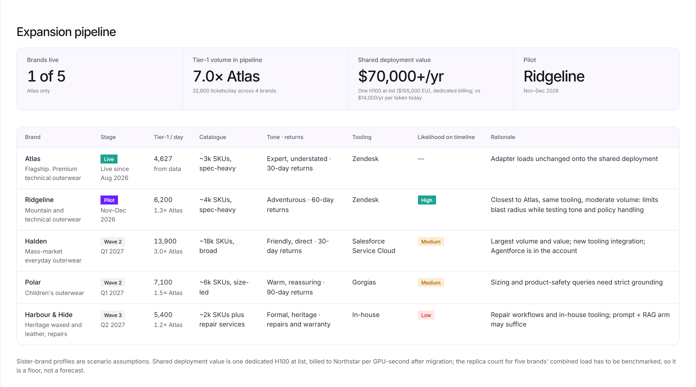
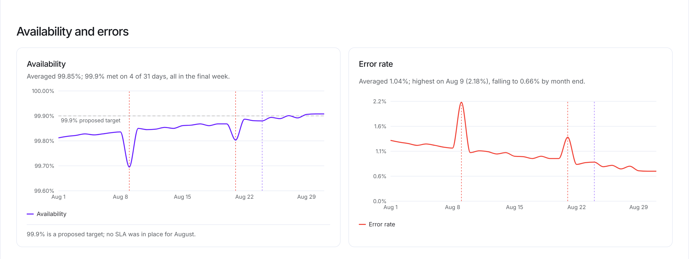
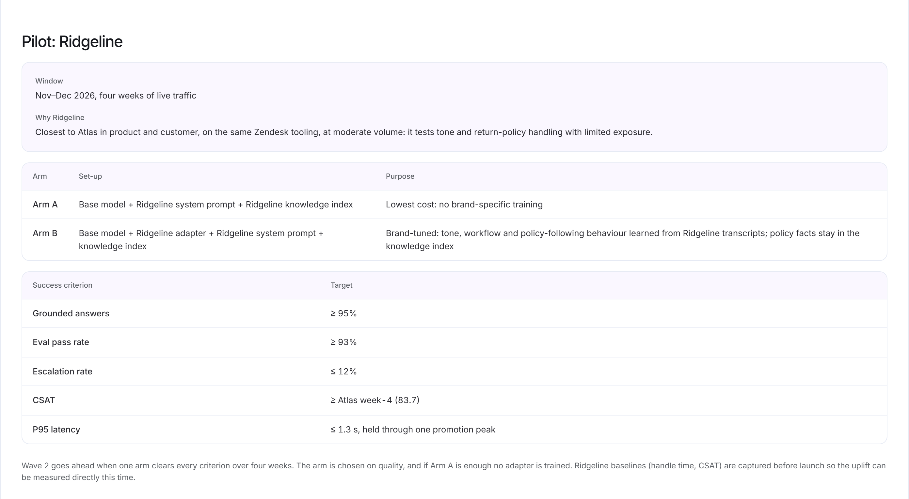

# Northstar dashboards: design document

**Northstar Retail Group · Atlas customer-support deployment · August 2026 data**

Northstar Retail Group is an outerwear group. A fine-tuned support model has been live on its flagship brand, **Atlas**, for one month on Fireworks, and the account's next step is to expand it to four sister brands. Two dashboards are built from the same 31-day dataset: the **internal QBR** for Fireworks' account, engineering and leadership teams, and the **customer account-health dashboard** for Northstar's VP Customer Experience and VP Engineering. They are separate apps that share one data, scoring and design package. Internal judgement cannot reach the customer build: they are separate applications by design, and the customer app never imports internal code.

## Assumptions

- **Scenario.** The brief gave no brand descriptions, so the outerwear setting, the Atlas name and the four sister brands (Ridgeline, Halden, Polar, Harbour & Hide) and their volumes are invented.
- **Billing.** `spend_usd` tracks tokens at a constant ~$1.12 per 1M, so Atlas is taken to be billed per token today. Token billing tells us nothing about GPU utilisation, so no utilisation figure is quoted.
- **Latency** columns are taken to be time-to-first-token. 331 output tokens in ~600 ms end to end would be implausible.
- **CSAT** is taken to be % satisfied. **Eval pass rate** came without its rubric, so it is treated as an end-to-end quality gate, and the rubric is listed as a dependency.
- **No SLA and no pre-launch baselines** were supplied. The 99.9% availability target is labelled as proposed, and the −35% handle-time and +12-point CSAT gains are attributed to Northstar.
- **Pricing** is from fireworks.ai/pricing, checked 5 Oct 2026. It is held in one file (`shared/src/pricing.ts`).

## 1. Audiences and the views that serve them

The internal QBR answers "are we on track, and what is blocking us?", so it is a working tool with operational detail, judgement and actions. The customer view answers the executive question "so what?", so it leads with outcomes and ends on a joint plan.

- **Fireworks account team:** *Account health* for where the account stands and what holds it back, *Performance trends* for the evidence, and the *Expansion plan* as its action list.
- **Fireworks engineering:** *Performance trends*, where every spike sits next to the event that explains it.
- **Fireworks leadership:** the score on *Account health*, then pipeline value, top risks and decisions needed on the *Expansion plan*.
- **Northstar VP Customer Experience:** *Outcomes* for results, *Answer quality* for whether answers are right and improving, and *Spend*.
- **Northstar VP Engineering:** *Service reliability*, including what we do not yet know about availability, then *Outcomes* and *Spend*.
- **Both VPs:** *Next steps*, with the pilot proposal, Northstar's dependencies and the joint plan.

## 2. Internal QBR dashboard

There are three views, **Account health**, **Performance trends** and **Expansion plan**. A **Single page** switch stacks all three.

<figure>
<strong>Account health.</strong> The customer score, its six pillars and eight headline metrics. Each tile opens its trend chart.
</figure>

<figure>
<strong>Performance trends.</strong> Nine daily charts, each with the 9, 21 and 24 Aug events marked.
</figure><figure>
<strong>Expansion plan.</strong> Sister-brand pipeline, then risks, stakeholders, margin, decisions and actions.
</figure>

## 3. Customer account-health dashboard

There are five views, **Outcomes**, **Service reliability**, **Answer quality**, **Spend** and **Next steps**, and the same **Single page** switch.

<figure>
<strong>Outcomes.</strong> Operational health on the four measured pillars, then eight headline metrics, with Tier-1 automation in place of spend.
</figure>

<figure>
<strong>Service reliability.</strong> Availability against a proposed 99.9% target, errors and latency.
</figure><figure>
<strong>Next steps.</strong> The Ridgeline pilot, what Fireworks needs from Northstar, and the joint actions.
</figure>

## 4. Why these metrics and visualisations

Every metric answers a question one of the audiences above would ask, and no chart is there just because the data allowed it. The brief's three outcomes (Tier-1 automation, handle time and CSAT) appear on both dashboards. Each one carries its caveat beside it: 70% automation is the month-end level, and the August average is 67.9%. The rest fall into three groups:

- **Is the platform working?** Availability, error rate, and P50 and P95 latency. P95 shows the burst behaviour that promotions expose.
- **Are the answers right?** Grounded answers and eval pass rate are direct measures of the model. Escalation rate is scored as first-contact resolution because that has a published benchmark.
- **What does it cost?** Spend and cost per 1k requests. Unit cost held steady as usage grew. Requests per day is shown but not scored, because requests per ticket rose from 4.6 to 6.2, so volume measures consumption, not adoption.

On the visual side, **headline tiles come first and charts sit one click away**. Each tile shows the August average, and a change line compares week 1 with the final week. Rates and latency use line charts, and spend uses bars with a cumulative line. **Every chart marks the operational events**, so the 9 Aug catalogue-sync incident and the 21 Aug promotion burst are never read as trends. The styling follows **Fireworks' own design language**, taken from fireworks.ai's CSS.

## 5. How the account-health score is calculated

**RAMP UP** is adapted from GitLab's customer health scoring framework, **PROVE** (Product, Risk, Outcomes, Voice of the customer, Engagement). RAMP UP is PROVE rebuilt for Fireworks' Deployment Strategists, whose question is not only whether the account is healthy but whether it is ready to expand. PROVE is written for a seat-based SaaS product, and it does not ask the questions an inference account raises: is the serving platform reliable, is the model right, and is the account worth what it costs Fireworks to serve? So Product becomes **Adoption**, Risk and Engagement become **Partnership**, and Outcomes and Voice of the customer become **User outcomes**. **Reliability**, **Model quality** and **Profitability** are added for inference. Every pillar is scored so that higher means healthier.

| | Pillar | Question it answers | Weight | Basis | August |
|---|---|---|---|---|---|
| **R** | Reliability | Is the platform up, error-free and fast? | 20% | Measured | 3.33 |
| **A** | Adoption | Is Northstar putting more of its support load on the model? | 20% | Measured | 3.00 |
| **M** | Model quality | Are the answers right? | 20% | Measured | 4.00 |
| **P** | Partnership | How committed is Northstar beyond the first deployment? | 10% | Judgement | 2 |
| **U** | User outcomes | What did Northstar's shoppers experience? | 20% | Measured | 4.00 |
| **P** | Profitability | Is the account commercially worth it to Fireworks? | 10% | Judgement | 2 |
| | **Overall (internal)** | | | | **3.27, Positive-Watch** |
| | **Operational health (customer)** | R, A, M and U at 25% each | | | **3.58** |

**Scoring rules.** Each metric scores 1 to 5 against the bands below, and a value on a band edge earns the higher score. Every metric uses the **31-day average**, not a trailing week. This is fair rather than flattering: the final week alone would score 3.73 internally and 4.17 for the customer. Values are rounded to display precision before scoring, so the number on screen is the number that was scored. A pillar is the mean of its metric scores, with P50 and P95 counting half each. The overall score is the weighted sum of the pillars. Status bands are **Healthy** at 4 or above, **Positive-Watch** from 3 to 3.99, **Negative-Watch** from 2 to 2.99 and **At risk** below 2. The measured pillars carry 80% of the weight, so evidence dominates.

| Metric | 5 | 4 | 3 | 2 | Calibration | Aug → score |
|---|---|---|---|---|---|---|
| Availability | ≥ 99.9% | ≥ 99.7% | ≥ 99.5% | ≥ 99.3% | Our bands (no SLA supplied) | 99.85% → 4 |
| Error rate | ≤ 0.5% | ≤ 1% | ≤ 2% | ≤ 5% | Observed LLM API error rates (~0.3–0.7%) | 1.04% → 3 |
| P50 latency | ≤ 300 ms | ≤ 500 ms | ≤ 800 ms | ≤ 1.2 s | Time-to-first-token guidance | 605 ms → 3 |
| P95 latency | ≤ 1.0 s | ≤ 1.5 s | ≤ 2.0 s | ≤ 3.0 s | As above, for the tail | 1.66 s → 3 |
| Tier-1 automation | ≥ 80% | ≥ 70% | ≥ 60% | ≥ 45% | Our bands, anchored to Freshworks and Salesforce | 67.9% → 3 |
| Grounded, eval pass | ≥ 95% | ≥ 90% | ≥ 85% | ≥ 80% | RAGAS CI gates; Microsoft Foundry structure | 93.9%, 93.1% → 4 |
| CSAT | ≥ 85 | ≥ 70 | ≥ 60 | ≥ 50 | Salesforce good/poor guidance | 82.3 → 4 |
| Handle time | ≤ 2m 03s | ≤ 12m 07s | ≤ 1h 08m | ≤ 2h 00m | Freshworks 2025, Retail & eCommerce | 7m 44s → 4 |
| First-contact resolution | ≥ 93.95% | ≥ 82.43% | ≥ 68.12% | ≥ 58.00% | Freshworks 2025 (score 2 is ours) | 87.2% → 4 |

**Focus areas** (internal only) lists the three items furthest from a perfect 5, ranked by their exact position within each band. For August these are Partnership, Profitability and P50 latency. The list is derived from the scores. It is separate from the risk register on the Expansion plan.

## 6. How internal and customer content differ

The customer dashboard uses the same figures from the same code. It leaves out the two judgement pillars (the Ps) and everything else the brief marks as internal.

| Content | Internal | Customer |
|---|---|---|
| Health score on the R, A, M and U pillars | Y | Y |
| Partnership and Profitability pillars, weights, status band | Y | N |
| Focus areas and metric methodology notes | Y | N |
| Headline metrics and trend charts | Y | Y |
| Risk register, competitive risk | Y | N: replaced by a Known caveats card |
| Pipeline likelihood, stakeholder coverage, margin | Y | N: pilot proposal and budget context only |
| Leadership decisions needed | Y | N |
| Joint actions with owners and dates | Y | Y: a test keeps them in step |

Operational events are restated in plain customer language. The customer score is labelled "Operational health, 1–5", with icons in place of pillar letters.

## 7. What each view intentionally excludes

The customer dashboard excludes everything marked N above. A boundary test fails the build if the customer app imports internal code or uses internal-only vocabulary. Neither dashboard carries methodology prose or names benchmark sources; that explanation lives in this document. Neither offers per-conversation drill-down, because the data is daily. Neither makes an SLA claim, and the pre-launch baselines are always attributed to Northstar. Numbers render as fixed facts, without animated count-ups.

## 8. Caveats and design trade-offs

The dashboards carry four caveats. Automation reached 70% only at month end. The baseline improvements are Northstar's figures. Availability missed 99.9% on 27 of 31 days, 25 of them outside the two incidents, and daily metrics cannot show why. Requests per ticket rose from 4.6 to 6.2, which is flagged for a joint review.

| Choice | Over | Why |
|---|---|---|
| Two separate apps sharing one package | One app with role-based views | The customer build cannot contain internal data, so there is no access control to get wrong |
| Full-period averages for every score | A trailing 7-day window | Fair rather than flattering (3.27 against 3.73 for the final week alone). The trend is shown separately |
| Adoption scored on automation only | Also scoring request volume | More requests per ticket would have counted as more adoption, the opposite of what matters |
| Judgement pillars at half weight | Equal weights | Evidence dominates, and the two judgement calls are visible rather than buried in the average |
| Telemetry before capacity | An always-on replica to reach 99.9% | Daily metrics cannot show why availability missed. A warm replica for Atlas alone costs ~$5.8k a month, against ~$1.2–1.8k per brand when shared |

## References: account-health methodology

- [GitLab handbook, customer health scoring (PROVE)](https://handbook.gitlab.com/handbook/customer-experience/customer-health-scoring/)
- [Freshworks Customer Service Benchmark 2025](https://www.freshworks.com/assets/resources/Customer-Service-Benchmark-Report-2025.pdf)
- [Salesforce, what is a customer satisfaction score](https://www.salesforce.com/uk/service/customer-service-incident-management/customer-satisfaction-score/)
- [Salesforce, State of Service 2025](https://www.salesforce.com/in/news/stories/state-of-service-report-announcement-2025/)
- [RAGAS, adding evaluations to CI](https://docs.ragas.io/en/v0.2.8/howtos/applications/add_to_ci/)
- [Microsoft Foundry, agent evaluators](https://learn.microsoft.com/en-us/azure/foundry/concepts/evaluation-evaluators/agent-evaluators)
- [LLM latency targets (time to first token)](https://particula.tech/blog/llm-latency-targets-ttft-tokens-per-second-2026)
