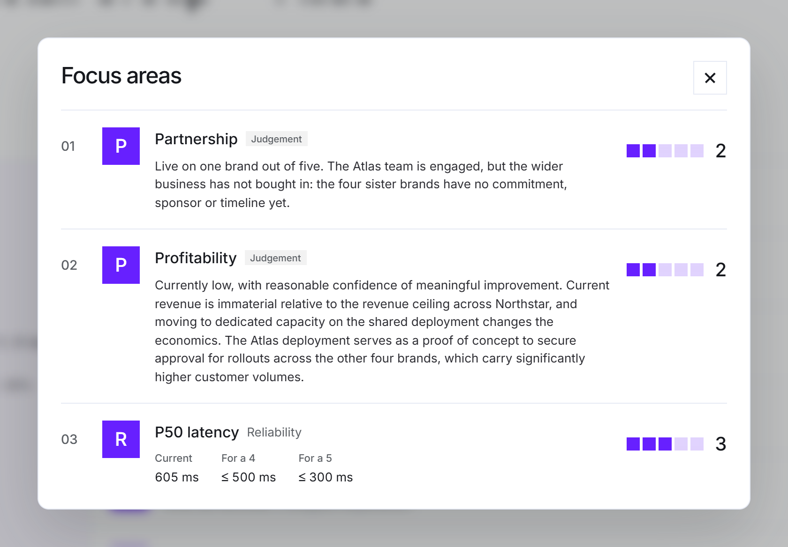
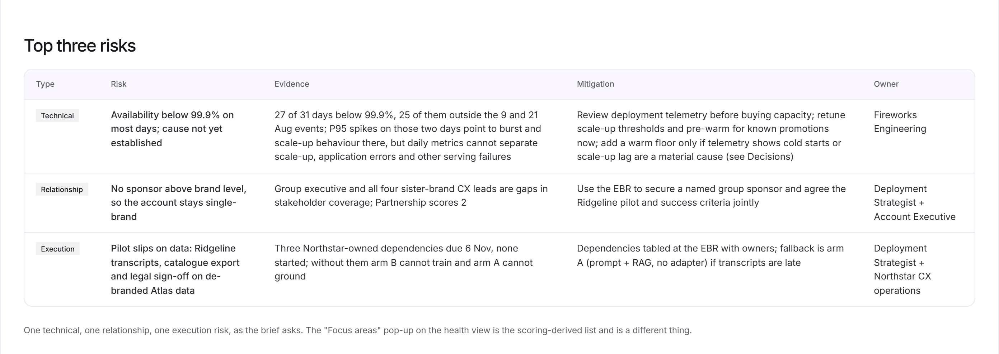
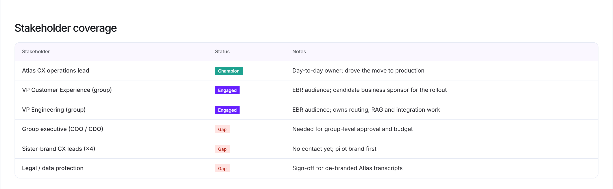
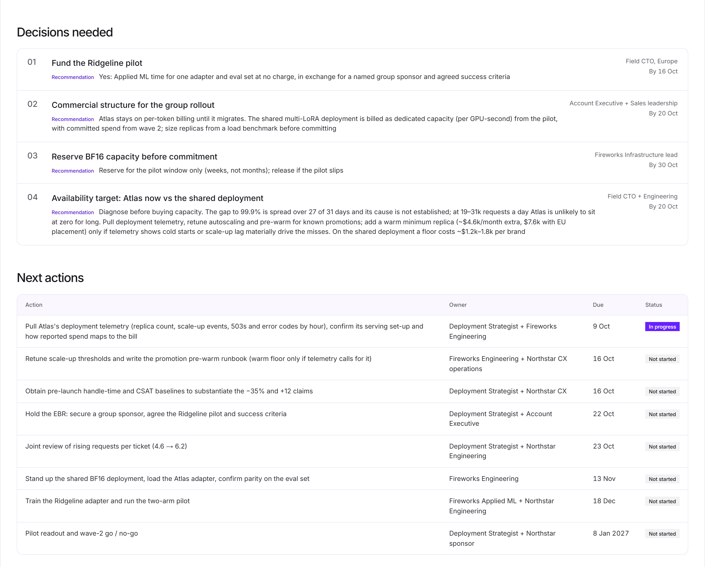
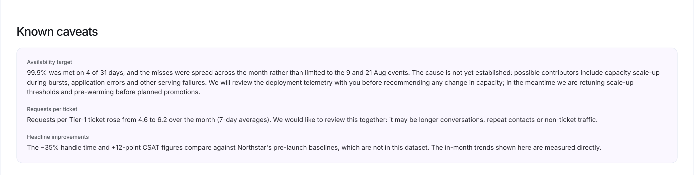
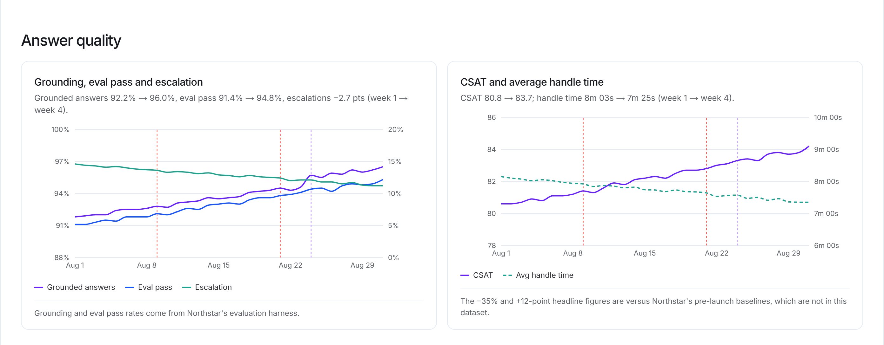
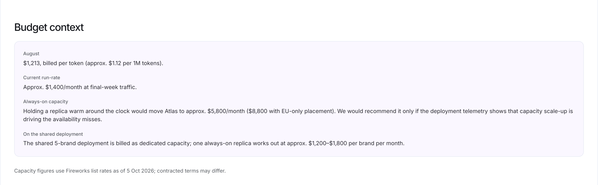

# Northstar dashboards: design document

**Northstar Retail Group · Atlas customer-support deployment · August 2026 data**

Two dashboards are built from the same 31-day dataset. The **internal QBR** is for Fireworks' account, engineering and leadership teams. The **customer account-health dashboard** is for Northstar's VP Customer Experience and VP Engineering. They are two separate apps sharing one data, scoring and design package, so internal judgement cannot reach the customer build. A test enforces this.

The sections follow the brief:

1. Internal QBR screenshots
2. Customer dashboard screenshots
3. Audience and purpose of each view
4. Why these metrics and visualisations
5. How the account-health score is calculated
6. How internal and customer content differ
7. What each view intentionally excludes
8. Assumptions, caveats and design trade-offs

---

## 1. Internal QBR dashboard

Three views behind a menu next to the logo: **Account health**, **Performance trends** and **Expansion plan**. A **Single page** switch stacks all three for reading end to end.

**Account health.** The customer score, its six pillars and the eight headline metrics. Each tile opens its chart.

**Focus areas.** Opened from the score panel: the three items furthest from a perfect 5, with what it takes to reach the next band.

**Performance trends.** Nine daily charts. Every chart marks the three operational events (9, 21 and 24 Aug); red marks incidents and purple marks changes.

**Expansion plan.** The pipeline across the four sister brands, followed by risks, stakeholder coverage, dependencies and margin, competitive risk, decisions needed and next actions.

## 2. Customer account-health dashboard

Five views: **Outcomes**, **Service reliability**, **Answer quality**, **Spend** and **Next steps**. It has the same **Single page** switch.

**Outcomes.** Operational health on the four measured pillars, then eight headline metrics: the internal set, with Tier-1 automation in place of spend.

**Service reliability.** Availability against a proposed 99.9% target, error rate and latency, plus a Known caveats card that states what is not yet known.

**Answer quality.** Grounding, evaluation pass rate and escalations; CSAT and handle time.

**Spend.** Daily and cumulative spend, unit cost, and the budget context for the capacity decisions ahead.

**Next steps.** The Ridgeline pilot: why Ridgeline, the two arms and the success criteria. Below it on the page: what Fireworks needs from Northstar, and the joint actions with owners and dates.

## 3. Audience and purpose of each view

| View | Audience | Purpose |
|---|---|---|
| Internal: Account health | Account team, engineering, leadership | One number for the account, what is dragging it down, and the headline metrics behind both |
| Internal: Performance trends | Engineering, account team | The evidence: daily trends with operational events marked, so a spike is always read next to its cause |
| Internal: Expansion plan | Leadership, account team | Where to focus: pipeline and its value, top three risks, stakeholder gaps, dependencies, margin, competitive threats, decisions needed and actions |
| Customer: Outcomes | Northstar VP CX, VP Engineering | Demonstrated results: operational health and the headline metrics, each with its caveat |
| Customer: Service reliability | VP Engineering | Operational transparency, including what we do not yet know about availability and what we are doing about it |
| Customer: Answer quality | VP CX | Whether answers are right and getting better, and what shoppers experienced |
| Customer: Spend | VP CX, VP Engineering, finance | The bill in context, and what always-on capacity would cost alone versus shared |
| Customer: Next steps | Both VPs | The pilot proposal, Northstar's dependencies and the joint plan |

The split follows the standard QBR/EBR distinction. A QBR answers "are we on track, and what is blocking us?", so the internal dashboard is a working tool: operational detail, judgement and an action list. An executive review asks "so what?" and leads with outcomes, so the customer view leads with results, keeps operational detail one click away, and ends on a joint plan.

## 4. Why these metrics and visualisations

**Sources of inspiration**
- **The brief's three outcomes:** Tier-1 automation, handle time and CSAT appear on both dashboards. Each carries its caveat in the same place: 70% is the month-end figure (the August average is 67.9%), and the −35% and +12-point improvements depend on Northstar's pre-launch baselines, which are not in the dataset.
- **QBR practice:**
  - usage and health metrics, SLA performance, a health score;
  - open issues with owners, and dated actions on both sides;
  - avoiding the common failure of a "data dump" of every chart.

  That shaped the tile-first layout and the plan view.
- **EBR practice:** surface a metric only if it answers "so what?". This is why the customer view leads with outcomes and puts caveats next to each claim.
- **GitLab's customer health scoring (PROVE)** for the structure of the health score (section 5).
- **Published benchmarks** to calibrate what "good" means for each metric (section 5): the Freshworks Customer Service Benchmark 2025 (Retail & eCommerce), Salesforce's CSAT guidance and State of Service 2025, and the evaluation-framework practice of RAGAS and Microsoft Foundry.
- **The dataset itself:** daily figures for one deployment, so every metric is a daily series or an average of one. There is no per-conversation drill-down.

**Metric by metric**

| Metric | Why it is shown | Where |
|---|---|---|
| Tier-1 automation | The brief's headline outcome and the clearest measure of adoption: the share of Tier-1 work entrusted to the model | Customer tile, chart, Adoption pillar |
| Avg handle time | Brief outcome; the efficiency gain for Northstar's agents. Shown as minutes and seconds (7m 44s), because "7.74 min" reads as a decimal | Tile, chart, User outcomes |
| CSAT | Brief outcome; what shoppers felt | Tile, chart, User outcomes |
| Requests / day | Scale of use. Shown, but not scored: requests per ticket rose from 4.6 to 6.2, so request volume measures consumption, not adoption | Tile, chart |
| Availability, error rate | Is the platform up and error-free? The proposed 99.9% target is labelled as proposed; no SLA was in place | Tile, charts, Reliability |
| P50 / P95 latency | Speed of a chat answer. P50 is the typical case; P95 is the burst behaviour that promotions expose | Tile, chart, Reliability |
| Grounded answers, eval pass | Are the answers right? Direct measures of the model, kept separate from customer-experience measures | Tile, chart, Model quality |
| Escalation rate | Hand-offs to agents. Scored as first-contact resolution (100% − escalation) because it has a direct published benchmark | Tile, chart, User outcomes |
| Spend, cost per 1k requests | The bill and unit cost; unit cost held steady as usage grew | Internal tile, charts, customer Spend view |

**Visualisation choices**
- **Headline tiles first, charts one click away.** Each tile shows the August average. A change line underneath compares week 1 with the final week, coloured teal when it improves. Leaders read the tiles; engineers follow the link to the chart.
- **Line charts for rates and latency; bars plus a cumulative line for spend.** A second axis is used only when two related units tell one story (requests vs tickets, CSAT vs handle time).
- **Event markers on every chart,** so the 9 Aug catalogue-sync incident and the 21 Aug promotion burst are never mistaken for trends. Reference lines are dashed and labelled (70% automation, 99.9% proposed target).
- **The Fireworks design language,** taken from fireworks.ai's own CSS: colour tokens, the framed header, Inter type and square status pills. One colour is off-brand: amber, for the Positive-Watch status.

## 5. How the account-health score is calculated

**RAMP UP** is adapted from GitLab's customer health scoring framework, **PROVE** (Product, Risk, Outcomes, Voice of the customer, Engagement). It was rebuilt from a Fireworks Deployment Strategist's point of view.

PROVE is written for a SaaS seat-based product. An inference account has questions PROVE doesn't ask:
- Is the serving platform reliable?
- Is the model right?
- Is the account worth what it costs Fireworks to serve?

**How PROVE maps to RAMP UP:**
- **Product** becomes **Adoption**.
- **Risk** and **Engagement** become **Partnership**, read as readiness to expand beyond one brand.
- **Outcomes** and **Voice of the customer** become **User outcomes**.
- **Reliability**, **Model quality** and **Profitability** are the inference-specific additions.

The pillars are mutually exclusive, and every one is scored so that higher means healthier.

| | Pillar | Question it answers | Weight | Basis |
|---|---|---|---|---|
| **R** | Reliability | Is the platform up, error-free and fast? | 20% | Measured |
| **A** | Adoption | Is Northstar putting more of its support load on the model? | 20% | Measured |
| **M** | Model quality | Are the answers right? | 20% | Measured |
| **P** | Partnership | How committed is Northstar beyond the first deployment? | 10% | Account-team judgement |
| **U** | User outcomes | What did Northstar's shoppers experience? | 20% | Measured |
| **P** | Profitability | Is the account commercially worth it to Fireworks? | 10% | Account-team judgement |

**Scoring rules**
1. **Metric scores.** Each metric scores 1–5 against bands. A value on a band edge earns the higher score.
2. **Full-period averages.** Every metric uses the average of all 31 days, not a trailing week. This is fair to the numbers rather than flattering: scored on the strong final week alone, the account would read 3.73 internally and 4.17 on the customer view, against 3.27 and 3.58 for the month.
3. **Rounding.** Values are rounded to display precision before scoring, so the number on screen is the number that was scored.
4. **Pillar scores.** A pillar is the mean of its metric scores. P50 and P95 latency count half each, so latency counts once.
5. **Overall score and status.** The overall score is the weighted sum of the pillars, on a 1–5 scale. Status uses the same scale: **Healthy** ≥ 4, **Positive-Watch** 3–3.99, **Negative-Watch** 2–2.99, **At risk** below 2.
6. **Weights.** Measured pillars carry 80% of the weight, so evidence dominates. If a pillar has no input, its weight is shared among the others, as in GitLab's model.

**Bands and where they come from**

| Metric | 5 | 4 | 3 | 2 | Calibration |
|---|---|---|---|---|---|
| Availability | ≥ 99.9% | ≥ 99.7% | ≥ 99.5% | ≥ 99.3% | Account-team bands (no SLA was supplied); 99.9% = 5, then 0.2-point steps |
| Error rate | ≤ 0.5% | ≤ 1% | ≤ 2% | ≤ 5% | Observed server-error rates of major LLM APIs (~0.3–0.7%) |
| P50 latency | ≤ 300 ms | ≤ 500 ms | ≤ 800 ms | ≤ 1.2 s | Time-to-first-token guidance: under 500 ms feels instant |
| P95 latency | ≤ 1.0 s | ≤ 1.5 s | ≤ 2.0 s | ≤ 3.0 s | As above, for the burst tail |
| Tier-1 automation | ≥ 80% | ≥ 70% | ≥ 60% | ≥ 45% | Account-team bands, set against Freshworks (53% retail AI deflection) and Salesforce (30% of cases AI-handled today, 50% by 2027) |
| Grounded answers, eval pass | ≥ 95% | ≥ 90% | ≥ 85% | ≥ 80% | Account-team quality gates. RAGAS's example CI gates (0.95 / 0.90) set the 5 and 4 edges. Microsoft Foundry's agent evaluators supply the structure: component checks, plus a composite that passes only if every component passes |
| CSAT | ≥ 85 | ≥ 70 | ≥ 60 | ≥ 50 | Salesforce: above 70% is "good", below 50% "less desirable" |
| Handle time | ≤ 2m 03s | ≤ 12m 07s | ≤ 1h 08m | ≤ 2h 00m | Freshworks 2025, Retail & eCommerce conversational resolution time (Trendsetter / Performer / Aspirant) |
| First-contact resolution | ≥ 93.95% | ≥ 82.43% | ≥ 68.12% | ≥ 58.00% | Freshworks 2025, same tiers (score 2 is our extension) |

No framework publishes a five-step scale for every metric. Where the bands are ours, the table says so, and names the published figure they were anchored to.

**August result**

| Pillar | Inputs → metric scores | Pillar score |
|---|---|---|
| Reliability | Availability 99.85% → 4 · error rate 1.04% → 3 · P50 605 ms → 3 · P95 1.66 s → 3 | 3.33 |
| Adoption | Automation 67.9% → 3 (ended the month at 70.1%) | 3.00 |
| Model quality | Grounded 93.9% → 4 · eval pass 93.1% → 4 | 4.00 |
| Partnership | Live on one brand of five; no sponsor above brand level yet | 2 |
| User outcomes | CSAT 82.3 → 4 · handle time 7m 44s → 4 · first-contact resolution 87.2% → 4 | 4.00 |
| Profitability | Revenue currently immaterial (~$14k a year); expected to improve as Northstar moves to dedicated capacity on the shared deployment | 2 |
| **Overall (internal)** | | **3.27 / 5, Positive-Watch** |
| **Operational health (customer)** | R, A, M and U only, weights redistributed to 25% each | **3.58 / 5** |

**Focus areas** (internal only) lists the three items furthest from a perfect 5. Items are ranked by their exact position within each band, not by whole-number score: at 605 ms, P50 latency sits 65% of the way from a 3 to a 4. For August the three are Partnership, Profitability and P50 latency. This list is scoring-derived. The brief's top three risks (technical, relationship, execution) are a separate register on the Expansion plan view.

## 6. How internal and customer content differ

| Item | Internal QBR | Customer dashboard |
|---|---|---|
| Health score | All six pillars, 3.27, with status band, pillar letters and weights | Four measured pillars, 3.58, "Operational health, 1–5", pillar icons, no weights or status band |
| Metric notes | Assumptions and benchmark notes under each metric | Hidden: methodology is ours to explain, not theirs to read |
| Focus areas | Yes | No |
| Headline metrics and trend charts | Yes; spend among the eight tiles | Yes, the same figures from the same code; Tier-1 automation in place of spend |
| Operational events | As logged | Restated in plain customer language |
| Risks | Top three risks register; competitive risk | Known caveats card: what we don't yet know and what we're doing about it |
| Expansion | Pipeline with likelihood on timeline, stakeholder coverage, dependencies on both sides | Pilot proposal and Northstar's dependencies only |
| Money | Margin, deployment economics, shared-deployment value | Budget context: the bill, run-rate, and what always-on capacity would cost alone and shared |
| Plan | Leadership decisions needed; every action | Joint actions only, with the same dates and owners as the internal list (a test keeps them in step) |

## 7. What each view intentionally excludes

**From the customer dashboard.** The brief bars internal sentiment, competitive intelligence, margin and expansion confidence, so the customer dashboard leaves out:
- the Partnership and Profitability scores;
- the status band and Focus areas;
- likelihood on timeline and stakeholder status;
- competitors, margin and commercial-structure decisions.

A boundary test fails the build if the customer app imports internal code or uses internal-only vocabulary, so this can't regress.

**From the internal dashboard: methodology prose.** The page carries facts and evidence; explanation lives in this document.

**From both dashboards:**
- **Named benchmark sources.** They calibrated the bands; on the page they would add clutter, not evidence.
- **Per-conversation drill-down.** The data is daily.
- **Pre-launch baselines.** Not supplied, so the −35% and +12-point figures are always attributed to Northstar.
- **Any SLA claim.** None was in place for August.
- **Animated figures.** Numbers render as fixed facts. Motion is limited to a soft view entrance and hover states, with a reduced-motion fallback.

## 8. Assumptions, caveats and design trade-offs

**Assumptions about the data**
- **Billing.** `spend_usd` tracks tokens at a constant ~$1.12 per 1M on every day, so Atlas is taken to be billed per token today. On the proposed shared deployment, Northstar moves to dedicated capacity billed per GPU-second. GPU utilisation can't be derived from token billing, so none is quoted; it needs deployment telemetry or a load benchmark.
- **Latency.** The latency columns are assumed to be time-to-first-token: 331 output tokens in ~600 ms end to end would be implausible.
- **CSAT and eval pass.** CSAT is assumed to be % satisfied. The eval pass rate is supplied without its rubric, so it is treated as an end-to-end quality gate for planning; the rubric is a listed dependency.
- **Scenario.** Northstar is an outerwear group, and Atlas is the flagship. The four sister brands (Ridgeline, Halden, Polar, Harbour & Hide) and their volumes are invented, because the brief's brand descriptions were not supplied.
- **Pricing.** From fireworks.ai/pricing, checked 5 Oct 2026: H100 $8.00/GPU-hour and region-restricted deployments 1.5×. Every price lives in one file (`shared/src/pricing.ts`); re-check before presenting.

**Caveats shown on the dashboards**
- **Automation.** 70% is the month-end level; the August average is 67.9%.
- **Baselines.** Handle-time and CSAT improvements versus baseline use Northstar's figures.
- **Availability.** Availability missed 99.9% on 27 of 31 days, 25 of them outside the two incidents. The cause is not established from daily metrics.
- **Requests per ticket.** Requests per ticket rose from 4.6 to 6.2 and is flagged for a joint review.

**Design trade-offs**

| Choice | Over | Why |
|---|---|---|
| Two separate apps sharing one package | One app with role-based views | The customer build cannot contain internal data, so there is no access control to get wrong. Cost: some duplicated view code |
| Full-period averages for every score and tile | A trailing 7-day window | Fair rather than flattering: the final week alone scores 3.73 internally (4.17 for the customer) versus 3.27 (3.58) for the month. The trend is shown separately as change lines and charts |
| Adoption scored on automation penetration only | Also scoring request-volume growth | More requests per ticket would have scored as more adoption, the opposite of what matters. Automated-ticket growth (+15% vs total tickets +8%) is shown as context |
| No rate-of-change score for adoption | Crediting August's steady climb (+5.4 points a month) | Growth has a ceiling: a highly automated account has little room left, so a pace score would penalise the best accounts |
| Judgement pillars at half weight | Equal weights | Evidence should dominate. The two judgement calls are visible and explained, not hidden in the average |
| Profitability from Fireworks' side | Customer return on investment | Customer value already shows in User outcomes and the EBR. Scored 2: low today, but with a clear path as Northstar moves to dedicated capacity |
| Lenient availability bands (99.9% = 5) | Anchoring to a 99.99% enterprise SLA | No SLA was in place. Anchored to 99.99%, August would score a 2. Both scales are documented |
| CSAT on Salesforce's good/poor guidance | Freshworks' retail CSAT tiers | Freshworks' tiers come from surveys of mostly human-agent chats, too harsh a yardstick for an AI agent's first month |
| Escalation scored as first-contact resolution, in User outcomes | Scoring it under Model quality | It has a direct published benchmark, and Model quality stays about whether answers are right |
| Telemetry before capacity | Recommending an always-on replica to reach 99.9% | Daily metrics can't show why availability missed. A warm replica is ~$5.8k/month for Atlas alone versus ~$1.2–1.8k per brand when shared, so it is recommended only if telemetry shows cold starts or scale-up are the cause |
| Focus areas separate from the risk register | One list for both | A scoring-derived "lowest items" list and a technical / relationship / execution risk register answer different questions |
| Customer view hides methodology | Showing weights, letters and notes | Northstar's VPs need what each pillar measures and its score; the acronym and weights are our method |
| Exact Fireworks design language | A generic dashboard theme | The audience is Fireworks; fidelity signals care. The customer view mirrors what Northstar would see from Fireworks in production |
| Data bundled at build time | Loading the CSV at runtime | Nothing can fail to fetch. A malformed CSV shows an error panel naming the problem; replacing the file and rebuilding updates both dashboards |
